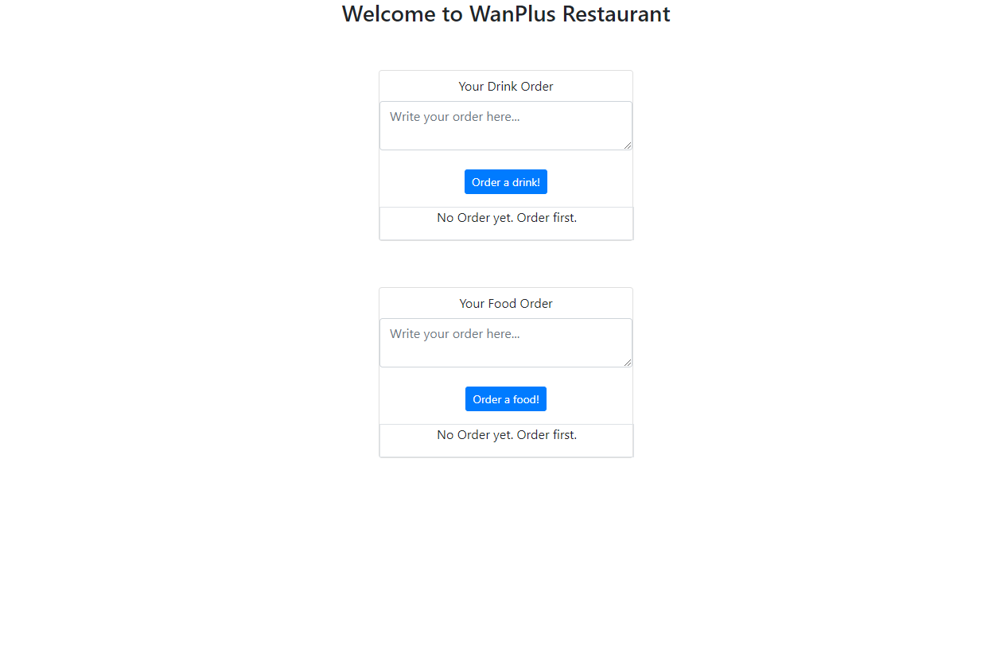
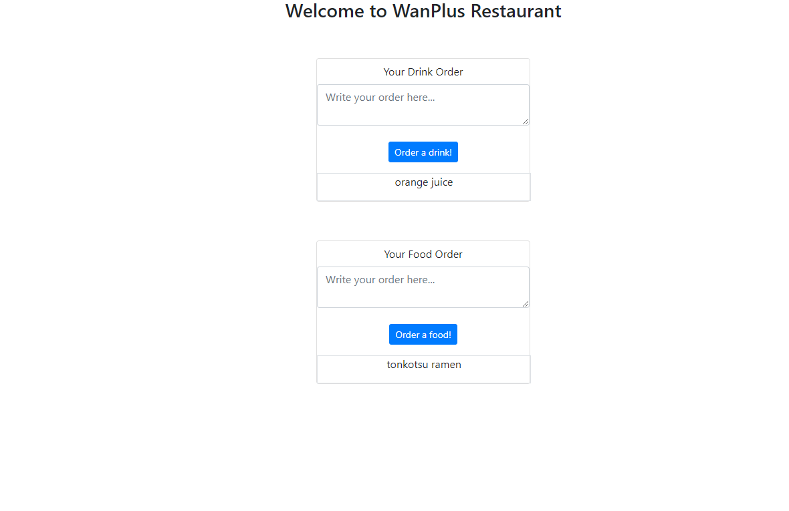

[](https://gitlab.com/vanessaemilyagape9000/advprog-tutorial-2021/-/commits/tutorial-4)
# Tutorial 4
# I Can't Believe I Got Transported Into A Fantasy World as An Adventurer, but Works in A Restaurant!


## Senyuman

Realis, jika bukan pengalaman yang indah, setidaknya berkesan untuk anda. Di kepala anda niat atau pun tujuan [] (Empty List) mengirimkan
anda kemari masih kelabu. Ia terlihat mencurigakan. Dengan sikapnya yang penuh tanda tanya itu anda tidak mungkin bisa mempercayainya. Namun, setidaknya saat ini mengikuti arus adalah hal yang bisa anda lakukan.

Senyuman Sancta Sophia dan penduduk Realis setidaknya memberikan anda satu hal: melihat mereka bahagia , anda menjadi merasa puas.
Entah itu perasaan tulus yang suci atau sebuah egoisme untuk memenuhi hastrat anda sendiri. Yang penting bagi anda sendiri, ini adalah apa yang akan anda lakukan.
Setelah berbincang kecil dengan alam bawah sadar yang menggelitik pikiran anda, anda memutuskannya: mulai saat ini anda akan berkelana entah kemana
lalu menyebarkan kebahagian dengan membantu orang-orang menggunakan kemampuan *programming* anda. 

Anda terus berjalan, bertemu orang-orang, dan membantu mereka. Hal itu terjadi berkali-kali. Wajah-wajah tersenyum yang berbeda membekas
di pikiran anda. Senyuman itu begitu banyak sehingga anda lupa sudah ada berapa orang yang anda bantu. Negeri yang setengah hancur menjadi
hidup kembali, membuat kota terbuang menjadi pusat perdagangan. Anda sudah mulai lupa berapa banyak hal-hal seperti demikian anda lakukan. Setiap
kali anda selesai di suatu tempat, anda lantas pergi. Tidak ada yang dapat mengikat anda lagi, pikir anda. 
Di kepala anda saat ini inilah tujuan [] membawa anda ke masa ini. Agar sayap anda terbentang bebas. Agar anda dapat melayang di angkasa, sesuka hati anda. 

Saat ini anda menginap di sebuah penginapan sederhana. Anda baru terbangun di pagi ini. Sinar mentari pagi agak mengusik anda, menyilaukan pandangan.
Namun, yang menarik perhatian anda adalah sebuah benda asing yang anda tidak ingat pernah meletakkannya. Anda juga cukup yakin mengunci pintu semalam, tidak mungkin
ada yang bisa meletakkannya di sana. Anda lalu mendekat dan menatap benda itu lekat-lekat. 

*Sebuah surat* pinta anda. Di samping ranjang anda tidur terdapat amplop kecil denga nama anda di atasnya. Ketika anda melihat
benda itu, tidak ada yang aneh. Itu seperti surat biasa. Hanya saja siapa yang mengirimkannya? Sang pengirim bahkan tidak mau menuliskan namanya. 

```
Kepadą̴̤͔͕̰̯̌͊̔͑͘͠ẽ̸͖͔̪̜͉͐̐̎̀̾̑̋͝͝r̴̡̨̪̘̝̠̗͈͗̾̌̀̃ȯ̵̜̼͂̌͆̇͘͘,

Jcvtajjs. Vilkmj gu Dqglik. Xadmmvy qqjqdqsc yrpw. 

Dengan vigeormat,

iyemwwqkm
```


Isi surat tersebut membuat kedua alis mata anda naik. Apa maksudnya ini? Namun, mau anda bertanya sekalipun, tidak ada jawaban. Anda bahkan tidak
tahu siapa yang mengirimkan. Anda lalu menyimpannya saja dan menggapnya berlalu. 

## (Abstract Factory Pattern)
------------------------
Anda lalu sampai di suatu dunia bernama Teyney. Pada dunia Teyney yang luas, para ***adventurer*** dapat memasak sendiri di alam liar dengan berbagai macam cara.
Anda bertemu dengan seorang ***adventurer*** di sana. Seorang ***adventurer*** yang terdampar di dunia Teyney ini akan memasak dengan menyimulasikan toko ramen terkenal di daerah Liyuan yang pernah dikunjunginya.
Sang ***adventurer*** memiliki bahan-bahan yang diperlukan, namun sayangnya ***adventurer*** melupakan bahan apa saja yang dibutuhkan untuk memasak sesuai dengan resep ramen yang diajarkan. 
Untungnya, a certain e̸m̸e̷r̴g̷e̷n̸c̵y̶ ̵f̴o̸o̶d̸ yang selalu menemani pengelana membantu mengingatkan nama menu resep jenis ramen yang dipelajarinya dari beberapa negara yang pernah dikunjunginya. 
Kamu diwajibkan mengimplementasikan ***Abstract Factory Pattern*** pada WanPlus Restaurant.

### TODO List Abstract Factory Pattern
- [ ] Mengimplementasikan Abstract Factory Pattern.
- [ ] Mengimplementasikan class Menu dan subclass-nya.

## (Singleton Pattern)
------------------------
Setelah para ***adventurer*** kelelahan, terdapat ***restaurant*** yang bisa digunakan para ***adventurer*** untuk makan. ***Adventurer*** bisa memesan makanan menggunakan ***singleton pattern***.  ***Singleton pattern*** disini digunakan sebagai perantara antara koki dan para ***adventurer*** agar order tidak berantakan. Disini kamu ditugaskan untuk membantu para koki dan ***adventurer*** untuk membuat ***singleton pattern*** baik untuk order makanan dan minuman. 

Kamu diwajibkan membuat Order minuman menggunakan ***approach*** lazy instantiation Singleton Pattern. Untuk Order makanan, kamu diwajibkan menggunakan ***approach*** eager instantiation Singleton Pattern. Selain itu, kamu juga diwajibkan untuk membuat ***test*** pada ***singleton pattern*** yang dibuat. 

### Example
Berikut contoh tampilan sistem yang telah terimplementasi dengan baik.

*Kondisi awal tampilan*

 *Kondisi setelah mengisi ***text field*** dan melakukan klik pada tombol order*

### TODO List Singleton
- [ ] Mengimplementasikan ***approach*** lazy instantiation Singleton Pattern untuk `core/OrderDrink.java`
- [ ] Mengimplementasikan ***approach*** eager instantiation Singleton Pattern untuk `core/OrderFood.java`
- [ ] Memahami penggunaan Singleton Pattern masing-masing ***approach***. Jelaskan perbeadaan keduanya beserta keuntungan dan kekurangan masing-masing pada `notes.md` di root `tutorial-4` . 
- [ ] Menyesuaikan implementasi kedua ***approach*** yang pada `controller` dan `service`.
- [ ] Lengkapilah seluruh method test untuk core dan service. (note: tambahkan test yang khusus untuk test hanya satu instance yang terbuat pada test di kedua ***approach*** singleton pattern ini).

### Bonus: Code Coverage

- [ ] Buat Code Coverage di atas 95% total.
- [ ] Tampilkan Code Coverage pada README.md anda. 

Anda harus menyelesaikan kedua hal tersebut untuk dapat *redeem* nilai bonus anda. 